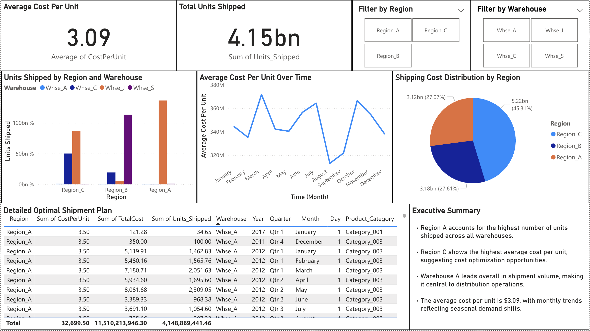

# Forecasts for Product Demand

This project focuses on building a predictive model to forecast product demand using historical sales data. It combines Python for model development and Power BI for business-level visualization. The goal is to help businesses improve inventory planning, reduce overstock or stockouts, and make better supply chain decisions.

## Project Objective

Forecasting demand accurately is essential for managing inventory and operations efficiently. This project uses real-world data to:

- Identify demand patterns across time, product categories, and locations
- Build regression models to predict future demand
- Visualize key trends and performance using a Power BI dashboard

## Dataset

- **Source**: [Kaggle – Historical Product Demand](https://www.kaggle.com/datasets/felixzhao/productdemandforecasting)
- **Size**: ~1 million rows
- **Main columns**:
  - Product Category
  - Warehouse and Region
  - Date
  - Units Sold

## Tools and Technologies

- **Python**: for data cleaning, preprocessing, and model building (libraries: Pandas, NumPy, Scikit-learn, Matplotlib)
- **Power BI**: for dashboarding and storytelling
- **Jupyter Notebook**: to run and document the analysis
- **Git & GitHub**: for version control and collaboration

## Process Overview

### 1. Data Cleaning & Preprocessing
- Removed missing values
- Converted date fields and created time-based features
- Encoded categorical columns for modeling

### 2. Exploratory Data Analysis (EDA)
- Analyzed seasonal trends and spikes in demand
- Compared performance across different regions and categories

### 3. Predictive Modeling
- Split the data into training and testing sets
- Applied regression models (Linear Regression, Random Forest)
- Evaluated using metrics like MAE and RMSE

### 4. Power BI Dashboard

An interactive Power BI dashboard was developed to present:
- Category-level demand trends
- Regional comparisons
- Forecast results and model error

Due to access limitations, the live dashboard link is not publicly shareable.  
However, a preview screenshot has been included below.

## Power BI Dashboard (Preview)

This dashboard visualizes key metrics like total units shipped, average cost per unit, and a detailed shipment plan. It also includes filters for warehouse and region analysis.



## Key Results

- The model was able to predict short-term demand trends with good accuracy
- Power BI visualizations revealed sales seasonality and underperforming regions
- The dashboard enables stakeholders to make informed inventory decisions quickly

## How to Use This Repository

1. Clone the repository:
   ```bash
   git clone https://github.com/Aaditya0212/Forecasts-for-Product-Demand.git